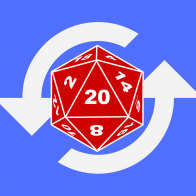

# The RPG Recapper


<br/>

As a Dungeon master, have you ever wished that there was a more **visual** way that you could recap your RPG adventures to your hereos and with a simple click of a button replay the entire campaign for everyone to see, ranging from the vast distanes travelled to the intense battle encounters to the creative and ridiculous social interactions that the players have with NPCs?

Well look no further as the **RPG Recapper** is the tool for you...
<br/>
<br/>
<br/>

# WORK IN PROGRESS !

## What is the RPG Recapper?

The RPG Recapper is written in HTML, JS and CSS and is essentially a framework that is driven entirely by user created JSON objects. The RPG Recapper takes in data about your campaign and 

## Installation

## Using it...

The most important folder in this entire system is the folder:

> /data

Inside of that folder you will find a whole bunch of JSON files, the main one being: 

> /data/index.json

This contains all of the information about your campaign overall including, the map to use, the campaign name and the PCs in the campaign. However most importantly it contains data about the individual sessions that your campaign has had and these are consituted as literally sit down sessions from start to finish that you and your party have had. 

```
"sessions":[
    "data/session1.json",
    "data/session2.json",
    "data/session3.json",
    "data/session4.json",
    "data/session5.json"
]
```

As you can see **sessions** is an array of individual sessions and each session points to its own JSON file (also located in the /data folder). The individual session file is covered in a the section below...

## The Session file...


## The story behind the tool


