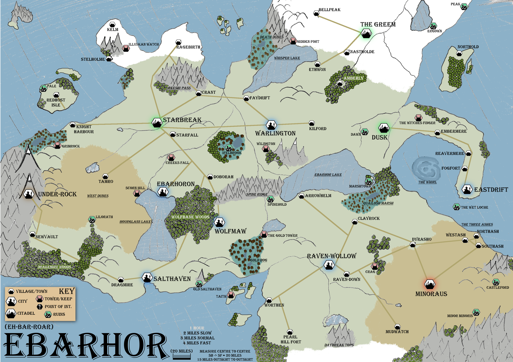
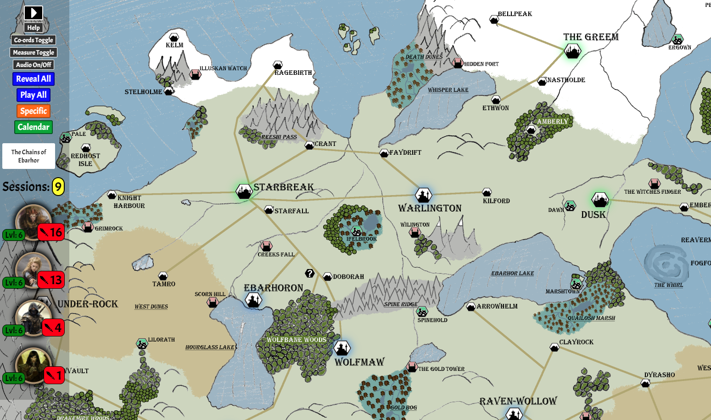

## IMPORTANT- Notice on media content...

So most of (if not all) the images and audio files that are included in this project have been taken from somewhere else on the wonderful web, I in no way take any credit for these wonderful works that others have done (except for my awesome map.png) 
<div style="text-align: center;"></div>
I have only included them as part of the project to give the software the visual and audio elements it needs in order to showcase its abilities. The idea is that when you take the software and use it for your campaign that you would replace the existing 'showcase' media with your own from your campaign... In order to test the software I actually needed an existing campaign to see if it did what I thought it would do so the data that is included is actually the data from my current DnD campaign that I am running, so thats nice.
<br/>Again I do not take credit for the image files or audio files included in this project they are there just to showcase the system...
<br/>
<br/>

Table of contents
=================

<!--ts-->
   * [The RPG Recapper](#the-rpg-recapper)
   * [What is it?](#what-is-it)
   * [Note](#note)
   * [Installation](#installation)
   * [Using it](#using-it)
   * [Dependencies](#dependencies)
   * [Contributing](#contributing)
   * [The Story](#the-story)
<!--te-->
<hr>

The RPG Recapper
-----


<br/>

As a Dungeon master, have you ever wished that there was a more **visual** way that you could recap your RPG adventures to your hereos and with a simple click of a button replay the entire campaign for everyone to see, ranging from the vast distanes travelled to the intense battle encounters to the creative and ridiculous social interactions that the players have with NPCs?

Well look no further as the **RPG Recapper** is the tool for you...
<br/>
<br/>
<br/>


What is it
-----
The RPG Recapper is written in HTML, JS and CSS and is essentially a framework that is driven entirely by user created JSON objects. The RPG Recapper takes in data about your campaign, characters and locations and presents them in a visual way that lets the players and spectators interact with them. It allows you to replay your campaign from session to session to see what happened in a simple animated way.
<div style="text-align: center;"></div>


Note
-----
This software is currently very much a work in progress. There is a TODO list as long as my arm however I am looking for people to contribute to this in order to get this to be a RPG Tool in every DM's/Player's arsenal.
<br/>
This README is also WIP...
<br/>
Also mega sorry about the messy state of the code, its currently a mess!
<br/>
<br/>
Also... The tokens are cool... Yeah, I used this awesome website to create tokens from full images...
<br/>http://rolladvantage.com/tokenstamp/<br/>

Installation
-----
1. Clone the repo...

```
git clone https://github.com/Kardelio/RPGRecapper.git
```

2. cd into the folder...

```
cd RPGRecapper
```

3. you then need a web server to host this content so you can use either of the following command line soultions (depending on what you already have installed), you can ofcourse use XAMPP, LAMP, MAMP or WAMP depending on OS to host it too...

```
python -m SimpleHTTPServer 8000
    OR
php -S localhost:8000
```

4. Then all you need to do is access it in a web browser

```
localhost:8000/dnd.html
```

Using it
-----
The most important folder in this entire system is the folder:

> /data

Inside of that folder you will find a whole bunch of JSON files, the main one being: 

> /data/campaign.json

This contains all of the information about your campaign overall including, the map to use, the campaign name and the PCs in the campaign. However most importantly it contains data about the individual sessions that your campaign has had and these are consituted as literally sit down sessions from start to finish that you and your party have had. 

```
"sessions":[
    "data/session1.json",
    "data/session2.json",
    "data/session3.json",
    "data/session4.json",
    "data/session5.json"
]
```

As you can see **sessions** is an array of individual sessions and each session points to its own JSON file (also located in the /data folder). The individual session file is covered in a the section below...

### The Session file...

TODO write up how to use the session file

TODO write up the rest of the data folder...

Dependencies
-----
Currently the RPG Recapper uses JQuery to do a few DOM based things using the CDN link:
```
<script src="https://ajax.googleapis.com/ajax/libs/jquery/1.11.3/jquery.min.js"></script>
```

It also uses a google font, however this is again just to enrich the visual experience and this is subject to change.
```
<link href="https://fonts.googleapis.com/css?family=Acme" rel="stylesheet">
```

Both links can be found in the main campaign file **dnd.html**

Other than that I want to keep dependencies down to as close to 0 as possible I want it to be built without the need for dependencies (as much as possible).

Contributing
-----
TODO fill in this in....

The Story
-----
Here is the story TODO


